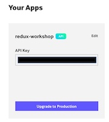
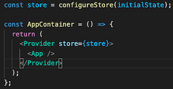

# Intro to Redux

## Today's 🔥 GIFs

## Objectives

- Understand, at a high level, what the following parts of redux are, and how they fit together:
  - redux store
  - reducers
  - actions
  - selectors
- Use thunks to allow for asynchronous workflows to update the redux store

## Why?

This lab is designed to give you an introduction to some of the most commonly used workflows in redux: fetching data from an API and storing it in a redux store, and then using data from the redux store in your application. You'll need to use these same workflows in your onboarding project.

As you learn redux and global state management more broadly, you may be thinking: "couldn't I just store all of this information in my components' state?" The answer is mostly yes. You absolutely could. As applications grow in complexity, however, global state management tools like Redux help to keep your application organized, which in turn improves maintainability and scalability. 

Redux is one such global state management tool. It is a library that helps manage the state of your application as it grows in complexity. It aims to manage updates to your application by adhering to 3 principles:
- having one single source of truth (the redux “store”)
- making state read-only
- only allowing state to be modified via pure functions (redux “reducers”).

Its aim is to make state mutations predictable to allow developers the ability to reason more clearly about the various interactions within an application.

# Key Vocab

- `store` - global readonly state. Due to its readonly state, reducers are used to mutate the state.
- `reducers` - pure functions whose responsibility is to process actions and manipulate the store's state.
- `actions` - following the Flux Standard Action (FSA) pattern, actions are objects that communicate to redux on what is happening. Reducers will interpret these action objects and decide what should be done.
- `selectors` - getter functions to retrieve specific data from redux. Can also be used to increase performance of constantly getting information from the store by memoization.s

## Directions

This lab has been tested in VSCode. You're welcome to run it elsewhere if you like, but the instructions are written with the assumption that you're operating on your code in the VSCode IDE.

## Getting Started:

1. Clone this repository down to your local environment and navigate to the root directory. Run `npm install` and then `npm start` to ensure you can preview your app.
1. Head to the [Giphy Developer Site](https://developers.giphy.com) and sign up for an account. Then head to the [dashboard](https://developers.giphy.com/dashboard/) and press the **+** icon in the **Your Apps** section to generate a new API key. You'll know you're ready to start the lab when your dashboard looks like:

   

1. Take some time to explore the app as it currently exists. Notice that it currently renders 5 gifs, which are coming from `src/data/sample_data.ts`. For this lab, we'll work to move our data fetching and storage from the data file to a redux store.

## Guidance:

1. **Add Sample Data to Redux Store** - to start this lab, we'll be working with the sample data file. The goal of this step is to take the data stored in the `src/data/sample_data.ts` file and store it in our redux store. Notice that in `App.tsx`, we have already added in the initial Redux store instantiation with the `configureStore` function and then wrapped our `App` component in the `Provider` component from `react-redux`

   

    You'll need to work in the `actions.ts`, `reducer.ts`, and `types.ts` files to add the data from data_store.ts to the redux store. You'll know you were succesful when you can see the initial state in the `State` tab of the Redux dev tools in your browser. 

1. **Incorporate stored data into the app**
1. **Fetch Data from API and add to Redux Store**

If you learn best by reading documentation first, then be sure to read the linked resources before attempting the corresponding challenges:

-

## Final Thoughts

- Takes time
- Patterns will remain familiar - it's okay if you don't understand everythign right away, and are pattern-matching for a little while
